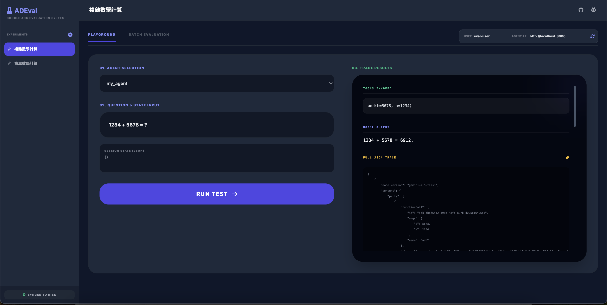
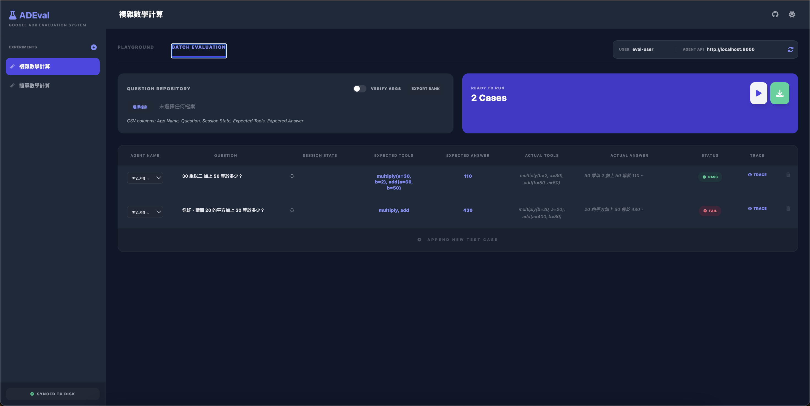

# ADEval - Google Agent Development Kit (ADK) AI Agent Evaluation System 🤖

[English Version](README.md) | [繁體中文版](README_zhtw.md)

ADEval is an evaluation tool designed specifically for developers using the Google Agent Development Kit (ADK). It provides an intuitive Web UI that allows you to systematically test your Agent's **Q-Tools-A (Question -> Tools -> Answer)** flow, supporting experiment management, batch testing, and comprehensive tracing.

**GitHub Repository:** [https://github.com/simonliu-ai-product/ADEval](https://github.com/simonliu-ai-product/ADEval)




## 🌟 Key Features

- **Designed for Google ADK**: Fully compatible with ADK's `/run` and `/list-apps` API specifications.
- **Experiment Management**:
  - Support for multiple independent experiments, with data automatically saved in the local `.adeval/` folder.
  - Complete records of experiment names, User ID, Agent API URL, and all test cases.
- **Q-Tools-A Validation**:
  - **Question (Q)**: Flexible configuration of test questions and Session State.
  - **Tools**: Automatic validation of whether the Agent invoked the expected tools (supporting order-independent smart comparison).
  - **Answer (A)**: Keyword matching to ensure Agent responses meet expectations.
- **Visual Tracing**:
  - One-click expansion of raw API responses, displaying the full JSON event stream in a dark terminal-style view.
- **Efficient Batch Processing**:
  - Support for importing test cases from CSV files.
  - Export "Question Bank backups" or "Test Result reports."
  - Real-time progress bar and completion statistics.
- **Modern Interface**:
  - Support for **Dark / Light Mode** switching.
  - High-quality responsive UI built with Vue.js 3 and Tailwind CSS.

## 🚀 Quick Start

### 1. Installation
Clone the repository and install in editable mode:

```bash
git clone https://github.com/simonliu-ai-product/ADEval.git
cd ADEval
pip install -e .
```

### 2. Launch UI
Run the following command to start the evaluation interface:

```bash
adeval ui
```
The default URL is: `http://127.0.0.1:8080`

### 3. Advanced Parameters
You can customize the Port or Host:

```bash
adeval ui --port 8081 --host 0.0.0.0
```

## 🐳 Docker Deployment

If you prefer using Docker, use the following commands to build and run:

### 1. Build Docker Image
Run this in the project directory:

```bash
docker build -t adeval:latest .
```

### 2. Run Container
It is recommended to mount a local directory to persist experiment data:

```bash
docker run -d \
  -p 8080:8080 \
  -v $(pwd)/.adeval:/app/data/.adeval \
  --name adeval \
  adeval:latest
```

## 📂 Data Storage Structure

All experiment data is stored in the `.adeval` folder under your execution directory:

```text
.adeval/
└── experiments/
    ├── exp_xxxxxx.json    # Experiment data (UTF-8 JSON)
    └── ...
```

## 🛠️ Tech Stack

- **Backend**: FastAPI (Python) - Handles API proxying, static file hosting, and data persistence.
- **Frontend**: Vue.js 3 + Tailwind CSS - Responsive Single Page Application (SPA).
- **CLI**: Typer - Simple and easy-to-use command-line tool.

---
ADEval - Making Google ADK Agent evaluation simpler and more professional.
