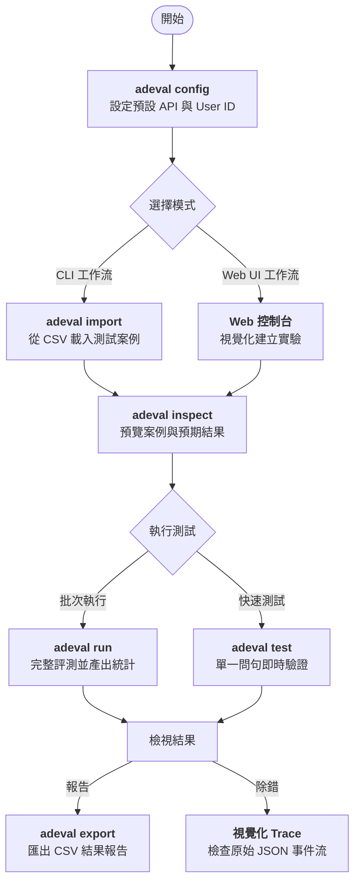

# ADEval - Google Agent Development Kit (ADK) AI 代理評測系統 🤖

[English Version](README.md) | [繁體中文版](README_zhtw.md)

ADEval 是一款專為使用 Google Agent Development Kit (ADK) 的開發者設計的評測工具。它提供直觀的 **Web UI** 與強大的 **CLI**，讓您可以系統化地測試 Agent 的 **Q-Tools-A (問題 -> 工具 -> 回答)** 流程，並支持實驗管理、批量測試與完整的追蹤紀錄。

**GitHub 儲存庫：** [https://github.com/ap-mic-inc/ADEval](https://github.com/ap-mic-inc/ADEval)  
**詳細文件：** [docs/zh-tw/index.md](docs/zh-tw/index.md)


## 🌟 核心特色

- **為 Google ADK 量身打造**：完全兼容 ADK 的 `/run` 與 `/list-apps` API 規範。
- **雙模式支持 (v0.2.0 新特性)**：無縫切換 **視覺化 Web UI** 與 **自動化 CLI**，適應不同的開發與 CI/CD 階段。
- **實驗管理**：
  - 支持多個獨立實驗，數據自動保存在本地 `.adeval/` 資料夾中。
  - 完整記錄實驗名稱、User ID、Agent API URL 以及所有測試案例。
- **Q-Tools-A 驗證**：
  - **問題 (Q)**：靈活配置測試問題與 Session State。
  - **工具 (Tools)**：自動驗證 Agent 是否調用了預期的工具 (支持順序無關的智能比對)。
  - **回答 (A)**：關鍵字匹配，確保 Agent 回答符合預期。
- **視覺化追蹤**：
  - 一鍵展開原始 API 回應，以深色終端風格顯示完整的 JSON 事件流。
- **現代化介面**：
  - 支持 **深色 / 淺色模式** 切換。
  - 使用 Vue.js 3 與 Tailwind CSS 構建的高品質響應式 UI。

## 🔄 使用邏輯工作流

ADEval 提供流暢的工作流程，協助您從定義測試案例到產出詳細的評測報告。



## 🚀 快速上手

### 1. 安裝
複製儲存庫並以可編輯模式安裝：

```bash
git clone https://github.com/ap-mic-inc/ADEval.git
cd ADEval
pip install -e .
```

### 2. CLI 使用 (強大的自動化工具)
ADEval v0.2.0 引入了完整的命令行介面，適合自動化腳本：

- **配置預設值**：`adeval config --url "http://localhost:8000" --user "tester"`
- **快速測試**：`adeval test "今天天氣如何？"`
- **匯入 CSV**：`adeval import my_cases.csv --name "回歸測試"`
- **執行與匯出**：執行 `adeval run <EXP_ID>`，然後使用 `adeval export <EXP_ID> -o results.csv` 導出報告。
- **內容檢視**：使用 `adeval inspect <EXP_ID>` 在終端機預覽測試案例。

### 3. 啟動 Web UI
執行以下指令啟動評測介面：

```bash
adeval ui
```
預設網址為：`http://127.0.0.1:8080`。您可以使用 `--port 8081` 自定義連接埠。

## 🐳 Docker 部署

如果您偏好使用 Docker，請使用以下指令進行構建與執行：

### 1. 構建 Docker 鏡像
```bash
docker build -t adeval:latest .
```

### 2. 執行容器
建議掛載本地目錄以持久化實驗數據：

```bash
docker run -d \
  -p 8080:8080 \
  -v $(pwd)/.adeval:/app/data/.adeval \
  --name adeval \
  adeval:latest
```

## 📂 數據存儲結構

所有實驗數據均存儲在執行目錄下的 `.adeval` 資料夾中：

```text
.adeval/
├── experiments/    # 實驗 JSON 檔案 (UTF-8)
└── config.json     # 全域 CLI 配置
```

## 🛠️ 技術棧

- **後端**: FastAPI (Python) - 負責 API 代理、靜態文件託管與數據持久化。
- **前端**: Vue.js 3 + Tailwind CSS - 響應式單頁應用 (SPA)。
- **CLI**: Typer + Rich - 現代化的命令行交互體驗。

## VIII. 關於作者

**Simon Liu**  
APMIC MLOps 工程師 x Google Developer Expert (GDE) in AI

一位熱衷於人工智能解決方案的技術愛好者，專注於協助企業導入生成式 AI、MLOps 與大語言模型 (LLM) 技術，推動數位轉型與技術實踐落地。

目前亦擔任 GenAI 領域的 Google Developer Expert (GDE)，積極參與技術社群，透過技術文章、演講與實戰經驗分享，推廣 AI 技術的應用與發展。至今已在 Medium 等平台發表超過百篇技術文章，涵蓋生成式 AI、RAG、AI Agents 等主題，並多次受邀擔任技術研討會講師，分享 AI 與生成式 AI 的實務應用。

**相關連結：**
- APMIC 官網：[https://www.apmic.ai/](https://www.apmic.ai/)
- 個人社群連結：[https://simonliuyuwei.my.canva.site/link-in-bio](https://simonliuyuwei.my.canva.site/link-in-bio)

## IX. 授權條款

本項目採用 Apache License 2.0 授權。詳見 [LICENSE](LICENSE) 文件。

---
ADEval - 讓 Google ADK Agent 評測更簡單、更專業。
